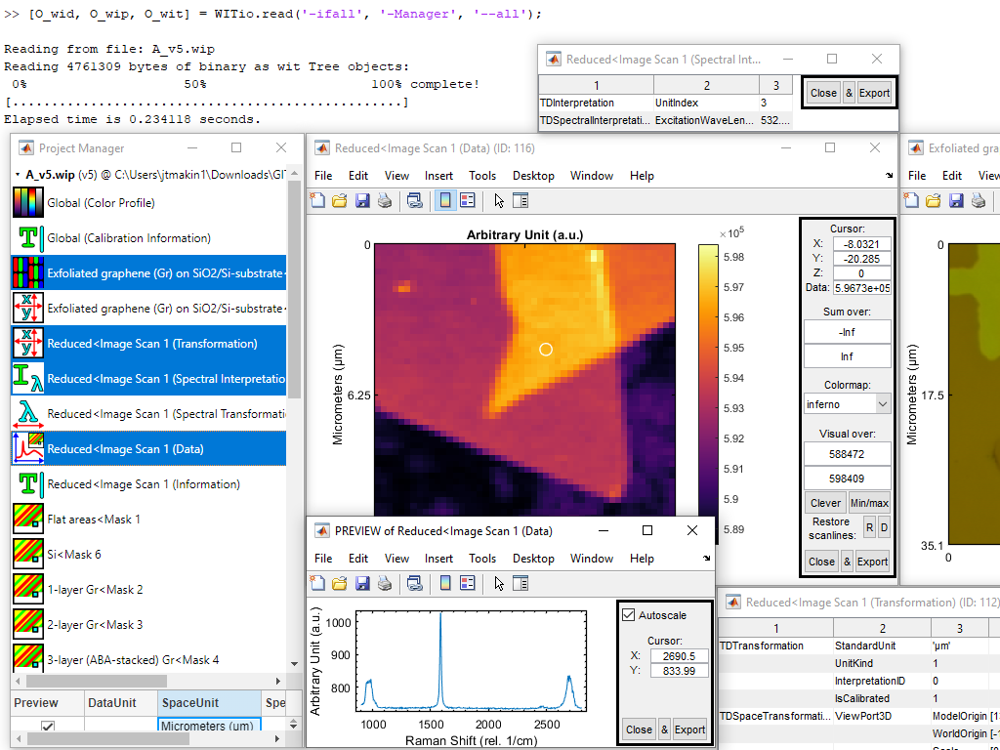

# **WITio**: A MATLAB data evaluation toolbox to script broader insights into big data from WITec microscopes

[![WITio v2.0.1 Changelog Badge][changelog-badge]][changelog]
[![BSD License Badge][license-badge]][license]
[![MATLAB Versions Badge][MATLAB-v-badge]][MATLAB]
[![MATLAB File-Exchange Badge][MATLAB-fe-badge]][file-exchange]

[changelog-badge]: https://img.shields.io/badge/changelog-WITio_v2.0.1-0000ff.svg
[license-badge]: https://img.shields.io/badge/license-BSD_3-ff0000.svg
[MATLAB-v-badge]: https://img.shields.io/badge/MATLAB-R2011a_or_newer-ff8000.svg
[MATLAB-fe-badge]: https://img.shields.io/badge/at-File_Exchange-ffff00.svg

## Overview

### Description
**WITio** is intended for the users of [WITec] microscopes, who work with WITec
Project/Data (\*.wip/\*.wid) files (v0&ndash;v7) and wish to enrich
their data evaluation by customized automation scripts within [MATLAB] environment.
Thanks to its fast bidirectional read/write capabilities, **WITio** bridges
the best of both WITec software and MATLAB software. The toolbox is a great
script-based automation platform for big data analysis and post-processing,
which reduces a lot of slow error-prone manual work. This includes file batch
processing, easily accessible customized tools and more systematic data evaluation.
When combined with the WITec software's *Autosaving* feature, they can together
even achieve powerful real-time during-measurement task automation for industrial
applications. To summarize, **WITio** aims to constantly open up new research
and commercial possibilities to the WITec community by jointly keeping up with
the ever-increasing big data for broader insights.

### Background
**WITio** (or formerly *wit_io* for v1 or *wip_reader* for v0) project began
in 2016 as a by-product of on-going MATLAB data evaluation of large Raman
spectroscopic datasets obtained by a confocal Raman microscope, *WITec alpha300 RA*.
The initial purpose was to reduce time spent at manual data exporting from
WITec software, and benefit from MATLAB's many libraries, scripting language
and improved suitability to big data evaluation. However, its original scope
grew much larger after it was completely rewritten by object-oriented programming
and gained ability to import data back to WITec software. During its development
(up to v2.0.1) author has worked for prof. Harri Lipsanen's group in Department
of Electronics and Nanoengineering, Aalto University, Finland.

## Usage

### License
This is published under **free** and **permissive** [BSD 3-Clause License][license].
Only exceptions to this license can be found in the [third party](./third%20party/)-folder.

### Installation to MATLAB (for R2014b or newer)
Download [the toolbox installer](./WITio.mltbx) and double-click it to install it.

### Installation to MATLAB (from R2011a to R2014a)
Download [the latest production zip archive](https://gitlab.com/jtholmi/wit_io/-/archive/production/wit_io-production.zip)
and extract it. For the first time, run MATLAB as administrator, go to the
extracted folder and execute [`WITio`](./WITio.m) in *Command Window* to permanently add
the toolbox folder to the MATLAB path.

### (Optional) Installation to the \*.wip/\*.wid context menus in Windows (for R2011a or newer)
Run MATLAB as administrator and execute [`WITio.tbx.wip_wid_context_menus`](./+WITio/+tbx/wip_wid_context_menus.m)
to add the **WITio** option to the \*.wip and \*.wid file right-click context
menus to enable a quick external call to `[O_wid, O_wip, O_wit] = WITio.read(file, '-ifall');`.

### Demo cases
Execute `WITio.demo` in *Command Window* to list all available demo cases and
left-mouse click to run `WITio.demo.A1_import_file_to_get_started` and so on.

### Semi-automated batch scripts
Consider using semi-automated batch scripts under [batch](./+WITio/+batch)-package on your
WITec Project/Data files. They will read the given file, interact with the
user, process the relevant file contents and finally write back to the original
file.

### Backward compatibility with *wit_io* v1.4.0.1 (or older) scripts
Transition from v1.4.0.1 to v2.0.0 involved **major and minor breaking changes**,
all described in [CHANGELOG.md][changelog]. It is highly recommended to go through
all renewed demo cases and inspect [WITio.tbx.backward_compatible.m](./+WITio/+tbx/backward_compatible.m) as well. Pass
on any questions to jtholmi@gmail.com

### Requirements and compatibility:
* Requires [MATLAB] on Windows, macOS and Linux operating systems.
* Compatible with MATLAB R2011a (or newer), but in the future may be limited
MATLAB R2014b to ensure improved OOP performance.

## Advanced users

### Any WIT-tag formatted file
**WITio** can also read and write **arbitrary** [WIT-tag formatted files](./+WITio/+doc/README%20on%20WIT-tag%20format.txt)
by `O_wit = WITio.obj.wit.read(file);` and `O_wit.write();`, respectively. They
can then be viewed interactively by executing `O_wit` in *Command Window*. Any WIT-tag
tree content can also be modified using `S_DT = WITio.obj.wit.DataTree_get(O_wit);`
and `WITio.obj.wit.DataTree_set(O_wit, S_DT);`.

### File format of \*.wip/\*.wid-files
See detailed information at [README on WIT-tag format.txt](./+WITio/+doc/README%20on%20WIT-tag%20format.txt),
which reveals the general file format and its \*.wip and \*.wid special cases
with their special `wip Project` and `wid Data` object tree structures.

## Contributing
You can begin contributing by **reporting bugs** and **requesting features**
at the [Issues](https://gitlab.com/jtholmi/wit_io/issues) page. You are also
most welcome to share some idea or code that has potential to add value to
everyone using the toolbox. For example, maybe some of your scripts could be
transformed into a new demo or a new batch case.

### Long-term goals
Each contribution should aim to continually improve the capacity of **WITio**
to script even broader insights into ever-growing big data from WITec microscopes.
In fact, the main goal is to jointly impact the world by constantly creating
new research and commercial opportunities for the WITec community.

## Additional information

### Citation (optional)
J. T. Holmi (2019). WITio: A MATLAB toolbox for WITec Project/Data (\*.wip/\*.wid)
files (https://gitlab.com/jtholmi/wit_io), GitLab. Version \<x.y.z\>. Retrieved
\<Month\> \<Day\>, \<Year\>.

### Third party content
* [Facebook's fast lossless compression algorithm, Zstandard (Java Native Interface -version)](https://facebook.github.io/zstd/)
* [Matplotlib's perceptually uniform colormaps](https://bids.github.io/colormap/)
* [A MATLAB toolbox for exporting figures in publication-quality](https://www.mathworks.com/matlabcentral/fileexchange/23629-export_fig)
* [A MATLAB function for labeling connected components in binary images](https://www.mathworks.com/matlabcentral/fileexchange/26946-label-connected-components-in-2-d-array)
* [A MATLAB function for calculating Euclidean distances in binary images](https://www.mathworks.com/matlabcentral/fileexchange/15455-3d-euclidean-distance-transform-for-variable-data-aspect-ratio)
* [A MATLAB function for evaluating Voigt function in high-accuracy](https://www.mathworks.com/matlabcentral/fileexchange/47801-the-voigt-complex-error-function-second-version)

### Acknowledgments
[\*] Academic supervisor of [jtholmi](https://gitlab.com/jtholmi):
[Prof. Harri Lipsanen](https://people.aalto.fi/harri.lipsanen), Aalto University,
Finland  
[1] [clever_statistics_and_outliers.m](./+WITio/+fun/clever_statistics_and_outliers.m):
G. Buzzi-Ferraris and F. Manenti (2011) ["Outlier detection in large data sets"](http://dx.doi.org/10.1016/j.compchemeng.2010.11.004)  
[2] [myinpolygon.m](./+WITio/+fun/+indep/myinpolygon.m): J. Hao et al. (2018)
["Optimal Reliable Point-in-Polygon Test and Differential Coding Boolean Operations on Polygons"](https://doi.org/10.3390/sym10100477)  
[3] Unpublished predecessor *wip_reader* and [apply_MRLCM.m](./+WITio/+fun/+image/apply_MRLCM.m)
(pp. 27&ndash;28,35): J. T. Holmi (2016) ["Determining the number of graphene layers by Raman-based Si-peak analysis"](http://urn.fi/URN:NBN:fi:aalto-201605122027)  

[file-exchange]: https://se.mathworks.com/matlabcentral/fileexchange/70983-wit_io
[changelog]: ./CHANGELOG.md
[license]: ./LICENSE
[WITec]: https://witec.de/
[MATLAB]: https://www.mathworks.com/products/matlab.html
